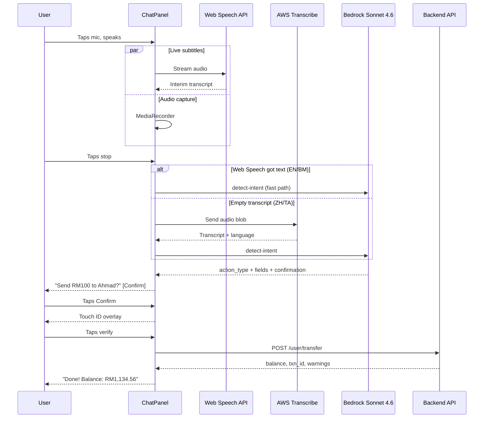

<div align="center">


# FormBuddy

**Voice-powered AI assistant for TNG eWallet**

[](https://main.d3is7aj4mo28yv.amplifyapp.com)
[](https://w6qtfxl2va.execute-api.ap-southeast-1.amazonaws.com/health)
[](#)
[](#)
[](#)

[Live Demo](https://main.d3is7aj4mo28yv.amplifyapp.com) · [Master Plan](docs/MASTER_PLAN.md) · [Presentation Guide](docs/PRESENTATION_GUIDE.md)

*TNG Digital FinHack 2026*

</div>

---

## What is this

8 million Malaysians can't use digital payments. Not because they don't have phones -- because they can't fill the forms.

FormBuddy is an AI assistant that lives inside TNG eWallet as a floating chat panel. Users tap the mic, speak in any language, and the assistant handles the rest -- understands intent, confirms the action, verifies identity, executes the transaction. The TNG app stays visible underneath the whole time.

Works in English, Malay, Mandarin, Cantonese, and Tamil. Handles transfers, fuel, bills, loans, and 10 other action types. Every transaction deducts real balance from a real database.

```
User:  "Nak pump minyak RON95 lima puluh"
AI:    "Baik! Bayar minyak RON95 RM50. Sahkan?"
       [Confirm] [Cancel]
User:  taps Confirm → Touch ID → Done
AI:    "Siap! Baki RM1,184.56"
```

Manual form UIs exist for every action too. Same backend, same balance, same fraud checks.

---

## Architecture

```
                    ┌──────────────────────────────────────┐
                    │            User's Browser            │
                    │                                      │
                    │   React 19 · Tailwind 4 · Vite 8    │
                    │   Web Speech API (live subtitles)    │
                    │   MediaRecorder → AWS Transcribe     │
                    │   Hosted on AWS Amplify (HTTPS)      │
                    └──────────┬───────────┬───────────────┘
                               │           │
                    REST/HTTPS │           │ audio blob
                               │           │
          ┌────────────────────▼──────┐    │
          │     AWS — Singapore       │    │
          │                           │    │
          │  ┌─────────────────────┐  │    │
          │  │ API Gateway HTTP    │  │    │
          │  │ └─► Lambda (FastAPI)│  │    │
          │  │     └─► Bedrock     │  │    │
          │  │        Sonnet 4.6   │  │    │
          │  │        (tool_use)   │  │    │
          │  └──────────┬──────────┘  │    │
          │             │             │    │
          │  ┌──────────┴──────────┐  │  ┌─▼──────────────┐
          │  │ Loan / BDA          │  │  │ AWS Transcribe  │
          │  │ 16 Lambdas          │  │  │ auto-language   │
          │  │ Bedrock Nova        │  │  │ en/ms/zh/ta     │
          │  │ (teammate)          │  │  └─────────────────┘
          │  └─────────────────────┘  │
          └────────────┬──────────────┘
                       │
                       │ pymysql
                       │
          ┌────────────▼──────────────┐
          │  Alibaba Cloud — KL       │
          │                           │
          │  RDS MySQL 8.0            │
          │  (OceanBase-compatible)   │
          │                           │
          │  users · transactions     │
          │  form_templates           │
          │  voice_sessions           │
          └───────────────────────────┘
```

Data stays in Malaysia on Alibaba Cloud RDS. Compute and AI run on AWS Singapore. Terraform manages both.

---

## Voice Pipeline



---

## Supported Actions

| Category | Actions |
|----------|---------|
| **Payments** | Fund Transfer · Fuel · Bills · Scan & Pay · Prepaid Reload |
| **Transport** | Toll / RFID · Parking |
| **Financial** | Check Balance · GO+ Investment · GOpinjam Loan · Insurance |
| **Lifestyle** | Buy Tickets · Food Delivery · Donations |

---

## Stack

| Layer | Technology | Cloud |
|-------|-----------|-------|
| AI (intent) | Bedrock Claude Sonnet 4.6, tool_use | AWS |
| AI (extraction) | Bedrock Nova | AWS |
| STT | AWS Transcribe + Web Speech API fallback | AWS + Browser |
| TTS | Web Speech API, natural voice selection | Browser |
| Backend | FastAPI, Mangum, Python 3.12 | AWS Lambda |
| Loan/BDA | 16 Lambdas (credit, extraction, disbursement) | AWS Lambda |
| Database | RDS MySQL 8.0 (OceanBase-compatible) | Alibaba Cloud KL |
| Frontend | React 19, TypeScript, Tailwind 4, Vite 8 | AWS Amplify |
| IaC | Terraform (aws + alicloud providers) | Both |

---

## Security

- Biometric verification (Touch ID / Face ID / PIN) before every transaction
- Fraud detection: large amounts (>RM500), high balance usage (>80%), first-time recipients
- Insufficient funds and negative amounts rejected
- HTTPS on all endpoints (Amplify, API Gateway, Bedrock)
- Encryption at rest (Alibaba RDS, AWS KMS)

---

## API

<details>
<summary><b>FormBuddy API</b> — <code>w6qtfxl2va</code></summary>

```
GET  /api/v1/user/balance           balance + user name
GET  /api/v1/user/transactions      transaction history
GET  /api/v1/user/accounts          demo account list
POST /api/v1/user/transfer          transfer with fraud checks
POST /api/v1/user/pay               fuel/bill/reload/scan payment
POST /api/v1/user/switch?user_id=N  switch demo account
POST /api/v1/user/reset             reset all to RM1,234.56
POST /api/v1/voice/detect-intent    AI intent detection
POST /api/v1/voice/transcribe       audio → AWS Transcribe
```

</details>

<details>
<summary><b>Loan / BDA API</b> — <code>ku63fvg2sc</code> (teammate — do not modify)</summary>

```
POST /credit/score                  credit score calculation
POST /upload/link                   presigned S3 upload
POST /extraction/extract            bank statement AI extraction
POST /extraction/confirm            confirm extracted data
POST /loan/apply                    loan application + status
```

</details>

---

## Project Layout

```
backend/
  api/routes/       user.py, analysis.py (voice + transcribe), dashboard.py
  services/         ai_service.py (Bedrock, 15 prompt rules), fraud_service.py
  models/           user, transaction, payment, alert
  core/             config, database
  main.py           FastAPI + Mangum + auto-seed

frontend/
  src/pages/        TNGHome, Transfer, Fuel, Reload, Bill, Scan, Balance,
                    Services, GOfinance, EShop, TaskPage, LoanPage
  src/components/   AppShell (tabs, account switcher, mic button)
                    ChatPanel (chat, biometric, execute, receipt)
  src/lib/          api.ts, flows.ts (14 actions), speech.ts (TTS)
  public/tng/       87 assets from TNG APK + CDN

infra/              Terraform (aws + alicloud)
docs/               MASTER_PLAN.md, PRESENTATION_GUIDE.md
```

---

## Running Locally

```bash
cd backend && pip install -r requirements.txt && uvicorn main:app --reload
cd frontend && npm install && VITE_API_URL=http://localhost:8000/api/v1 npm run dev
```

Needs Python 3.12, Node 20+, AWS credentials with Bedrock access, Alibaba Cloud RDS connectivity.

---

<div align="center">

**FormBuddy** -- financial inclusion, one voice at a time.

TNG Digital FinHack 2026 · Track 1: Financial Inclusion

</div>
